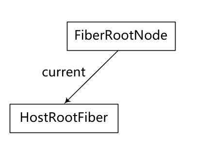
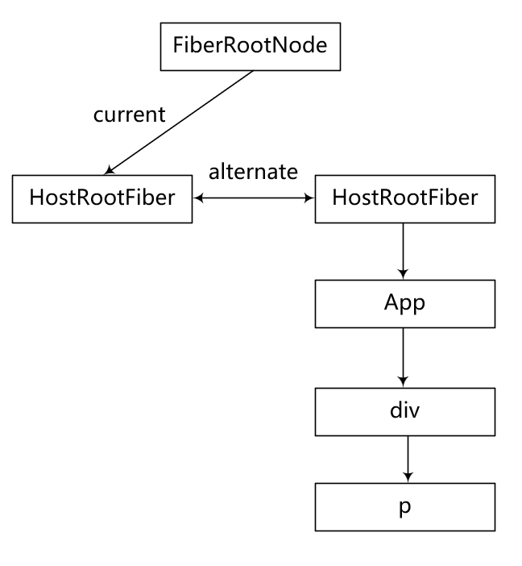
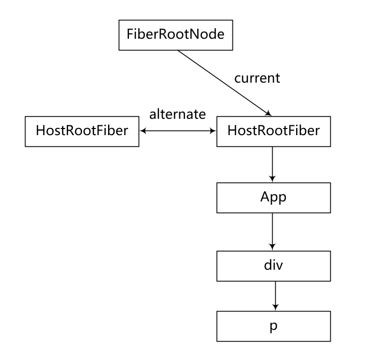
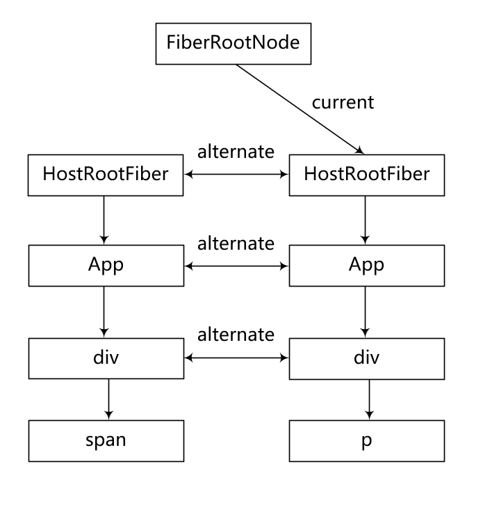
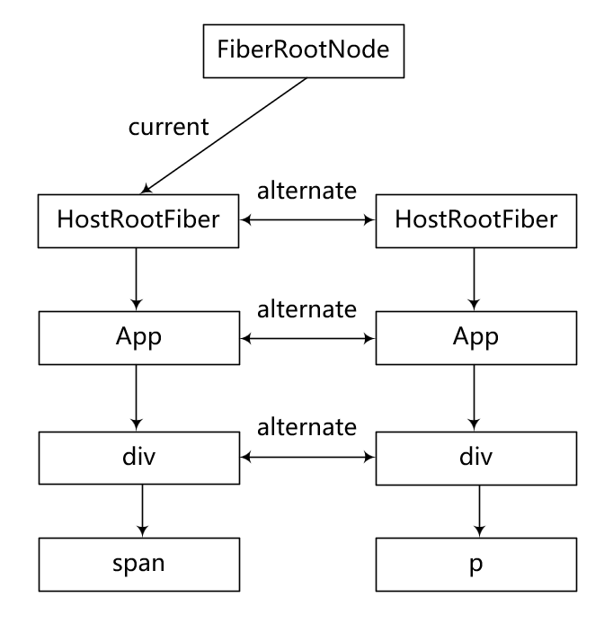

# 1 架构


## 1.1 V15及以前：Stack

是一棵 对像数，通过 递归遍历 来获取需要更新的内容

因此这个过程无法被打断，如果计算变更的时间过长会导致页面出现卡顿、掉帧


## 1.2 实现 “快速响应” 的瓶颈

### 1.2.1 CPU 瓶颈

- 大量计算
- 设备性能不足

从而导致页面出现掉帧

### 1.2.2 IO 瓶颈

- 等待数据返回

### 1.2.3 为了解决 CPU 和 IO 的瓶颈

- 可以针对不同的操作划分不同的优先级
- 高优先级任务先执行
- 当出现更高优先级的任务需要执行时，当前正在执行的任务能够中断
- 要在浏览器的空闲时间执行计算，当浏览器需要渲染的时候能够归还主线程的控制权

因此需要在技术上实现：

- 调度优先级任务的调度器
- 调度算法
- 支持可中断的虚拟DOM的实现


## 1.3 V16及之后：Fiber

### 1.3.1 渲染流程

​	UI = f(state)

1) render 阶段：调和虚拟DOM，计算出最终要渲染的虚拟DOM。这个过程在内存中运行，可随时中断。
   - Schedule：调度任务，让优先级高的先进入 Reconcile
   - Reconcile:：生成 Fiber 对象，收集副作用，找出变化节点，打上 flags，然后进行 diff 算法
2) commit 阶段：vdom => 真实 UI。这个过程在宿主环境中运行，同步执行，不可中断。
   - Renderer：根据协调器计算的 vdom 同步到视图

### 1.3.2 关于 Fiber

是一个链表结构，每个 FiberNode 会记录 React元素信息（子元素child、兄弟元素sibling、父元素return）、变化信息。

### 1.3.3 Fiber 双缓冲

双缓冲技术：显卡 有 前缓冲区 和 后缓冲区，前缓冲区用于显示图像，后缓冲区用于合成新的图像写入，写入完毕后两个缓冲区会进行交换，前缓冲区变为后缓冲区，后缓冲区变为前缓冲区，然后继续操作。这个技术叫做 双缓冲技术。

React 也采用了这个技术，所以叫做 Fiber 双缓冲。

两棵 Fiber Tree：

- current fiber tree：真实UI（前缓冲区）
- workInProgress fiber tree：内存中构建（后缓冲区）

两棵树中的 FiberNode 会通过 alternate 属性相互指向。

关于 mount 阶段和 update 阶段两棵树的构建：

假设有这样的一个dom结构：

```
<App>
	<div>
		<p>123</p>
	</div>
</App>
```

在触发更新的时候  `<p>123</p>` 变成了 `<span>123</span>`

1. mount 阶段：

   createRoot 时创建：

   

​	进入 mount 流程：

​		右边的tree就是 workInProgress fiber tree



​	render 阶段完毕后：




2. update 阶段

   

   ​	然后 render 阶段完毕后左边就是 current fiber tree 了：

   
