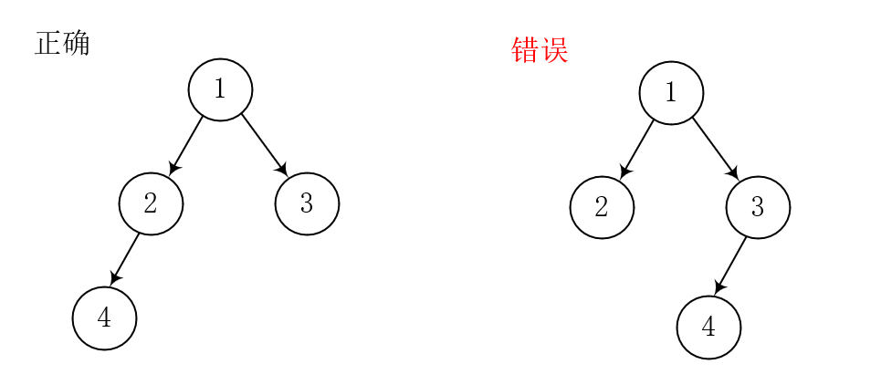
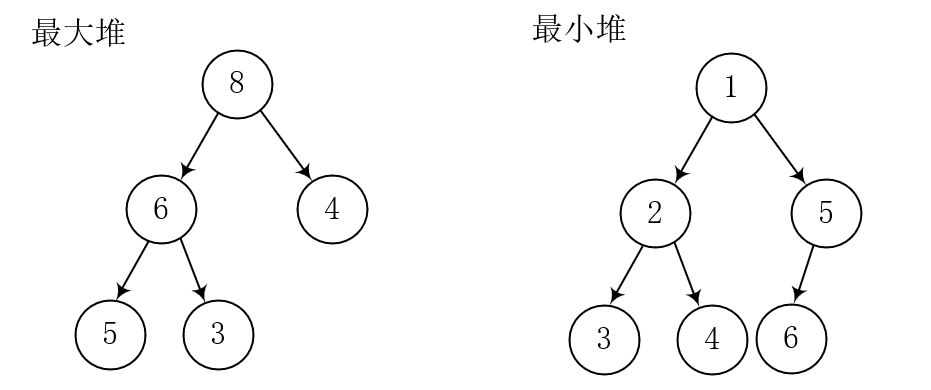

# 1. 最小堆

## 1.1 二叉树

一个父节点只能有1个或2个子节点

## 1.2 完全树

一棵树在填写的时候遵循：”从左往右，从上往下” 的原则

## 1.3 完全树中的数值

- 最大堆：父节点的数值大于或等于子节点
- 最大堆：父节点的数值小于或等于子节点

## 1.4 堆的实现

一般用数组

堆的每一层最多拥有 2 ^ n次方个节点

比如上面的这个最小堆：

| value | 1    | 2    | 5    | 3    | 4    | 6    |
| ----- | ---- | ---- | ---- | ---- | ---- | ---- |
| index | 0    | 1    | 2    | 3    | 4    | 5    |

一个获取相关节点的公式：

- 子节点对应的父节点： Math.floor((curIndex - 1) / 2)
- 父节点对应的左分支子节点：curIndex * 2 + 1
- 父节点对应的右分支子节点：curIndex * 2 + 2
